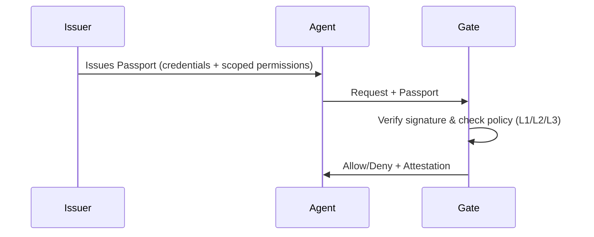

<p align="center">
  <picture>
    <source media="(prefers-color-scheme: dark)" srcset="assets/uniplex-logo-dark.svg">
    <source media="(prefers-color-scheme: light)" srcset="assets/uniplex-logo-light.svg">
    
  </picture>
</p>

<p align="center">
  <sub>Specification 2026-01-24 — SDK in development (early alpha)</sub>
</p>

<p align="center">
  <a href="https://uniplex.io">Documentation</a> · 
  <a href="SPECIFICATION.md">Specification</a> · 
  <a href="#quickstart">Quickstart</a> · 
  <a href="https://github.com/uniplexprotocol/uniplex/discussions">Discuss</a>
</p>

---

## What is Uniplex?

**Uniplex is a passport system for AI agents.**

AI agents are calling APIs and taking actions with no standard way to verify they're authorized. Uniplex is an open protocol that adds a lightweight trust layer for the agentic web:

- **Passports:** Agents carry signed credentials that prove what they are, who issued them, and what they're allowed to do.
- **Gates:** Any tool—MCP servers, LangChain tools, or APIs—can verify passports locally and make an allow/deny decision.
- **Pluggable (no rip-and-replace):** Works alongside your existing auth (API keys, OAuth/JWT, mTLS) and can be adopted incrementally—start at one tool boundary; run standalone in a single system or federate across many systems as needed.
- **Local-first:** Runs locally in the request flow—no network calls in the hot path and no shared secrets.
- **Security tiers (L1/L2/L3):** L1 is dev/test (optionally allow self-issued). L2 is production (trusted issuers + theft/replay protections + revocation policy). L3 is strictest (no implicit trust + hardened controls).
- **Vendor-neutral:** Not tied to any model provider; works with any agent framework, model, or tool stack—no single vendor is privileged by the protocol.

### How It Works



**Key insight:** Verification happens locally at the Gate — no round-trip to a central server for every tool call.

## Why Uniplex?

| Feature | API Keys | OAuth 2.0 | Uniplex |
|---------|----------|-----------|---------|
| **Designed for** | Systems/Services | Humans | AI Agents |
| **Scoping** | All-or-nothing | Centralized scopes | Action + Resource + Constraints |
| **Verification** | Server-side lookup | JWT validation or introspection | Local cryptographic check |
| **Latency** | Network round-trip | Often local (JWT); sometimes network (introspection) | Designed for sub-millisecond local checks |
| **Offline support** | No | Possible (JWT); not inherent | First-class |
| **Auditability** | Opaque logs | Token-based | Signed attestations |

> **Note:** OAuth can be validated locally when using JWT access tokens; Uniplex is purpose-built for agent credentials and tool-bound scoping with local-first verification.

## Quickstart

### Installation

```bash
pip install uniplex
```

### Create a Self-Issued Passport (L1)

> **Note:** L1/self-issued passports are intended for dev/test and low-risk reads. For production, use L2/L3 with trusted issuer policy and theft/replay protections.

```python
from uniplex import Passport

passport = Passport.create_self_issued(
    agent_id="my-agent",
    permissions=[
        {"action": "read", "resource": "file:*.txt"}
    ],
    ttl_hours=24
)
```

### Verify at a Gate

`Gate.check` accepts a `Passport` object or a base64-encoded passport string.

```python
from uniplex import Gate

# L1 is dev/test only; use L2/L3 in production
gate = Gate(profile="L1")

decision = gate.check(
    passport=passport,
    action="read",
    resource="file:config.txt"
)

if decision.allowed:
    # Proceed with operation
    pass
else:
    print(f"Denied: {decision.reason}")
```

### MCP Integration

```python
# Assuming you have an MCP server instance (e.g., FastMCP / your MCP framework wrapper).
# mcp_server is your MCP framework router/server instance.
# passport_b64 is the passport string provided by the agent.
from uniplex import Gate

# L2 requires a trusted issuer policy — configure your Gate with allowed issuers
gate = Gate(profile="L2")

@mcp_server.tool()
def charge_card(card_id: str, amount: int, passport_b64: str):
    # Gate.check accepts an encoded passport string (or a decoded Passport object)
    decision = gate.check(
        passport=passport_b64,
        action="payments.charge",
        resource=f"card:{card_id}"
    )

    if not decision.allowed:
        raise PermissionError(f"Denied: {decision.reason}")

    return {"status": "ok"}
```

## Integrations

- ✅ MCP (Model Context Protocol) servers
- 🔜 LangChain
- 🔜 CrewAI
- 🔜 AutoGPT

## Trust Profiles

| Profile | When to Use | Requirements |
|---------|-------------|--------------|
| **L1 Baseline** | Dev/test, low-risk reads | Self-issued allowed only if explicitly enabled by Gate policy |
| **L2 Standard** | Production authorization | Trusted issuer (enterprise/internal or verified/certified) + theft/replay protections + explicit revocation policy |
| **L3 Strict** | High assurance / multi-tenant | All L2 requirements + strict trust resolution (no implicit trust) + hardened theft protection |

## Documentation

- **[Specification](SPECIFICATION.md)** — Full protocol specification (2026-01-24)
- **[Documentation](https://uniplex.io)** — Guides, tutorials, API reference
- **[Examples](examples/)** — Working code samples

## Contributing

We welcome contributions! Please see [CONTRIBUTING.md](CONTRIBUTING.md) for guidelines.

- 💬 [Discussions](https://github.com/uniplexprotocol/uniplex/discussions) — Questions and ideas
- 🐛 [Issues](https://github.com/uniplexprotocol/uniplex/issues) — Bug reports and feature requests
- 𝕏 [@uniplexprotocol](https://x.com/uniplexprotocol) — Updates and announcements

## License

Apache-2.0 — see [LICENSE](LICENSE) for details.

---

<p align="center">
  <sub>Built by <a href="https://standardlogic.ai">Standard Logic Co.</a></sub>
</p>
