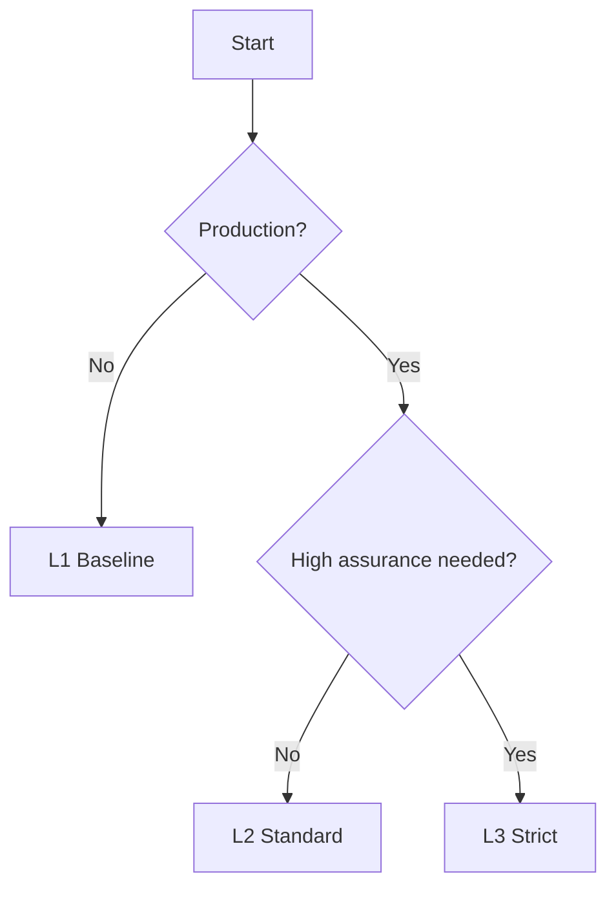

Uniplex defines three trust profiles that let you scale security based on your needs.

## Overview

| Profile | When to Use | Key Requirements |
|---------|-------------|------------------|
| **L1 Baseline** | Dev/test, low-risk reads | Self-issued allowed (if enabled) |
| **L2 Standard** | Production | Trusted issuers + theft/replay protections |
| **L3 Strict** | High assurance / multi-tenant | All L2 + no implicit trust + hardened controls |

## L1 Baseline

The simplest profile for getting started.

<CodeGroup>
```python Python
from uniplex import Gate, TrustProfile

gate = Gate(profile=TrustProfile.L1)
```
```typescript TypeScript
import { Gate, TrustProfile } from 'uniplex';

const gate = new Gate({ profile: TrustProfile.L1 });
```
</CodeGroup>

**Checks performed:**
- ✓ Signature verification
- ✓ Expiration check
- ✓ Issuer policy
- ✓ Permission check

**Use for:**
- Local development
- Testing
- Low-risk read operations

<Warning>
L1 allows self-issued passports if explicitly enabled. Do not use L1 in production for sensitive operations.
</Warning>

## L2 Standard

The production-ready profile with anti-theft protections.

<CodeGroup>
```python Python
from uniplex import Gate, TrustProfile

gate = Gate(
    profile=TrustProfile.L2,
    policy={
        "allowed_issuers": ["issuer:acme"]
    },
    require_pop=True
)
```
```typescript TypeScript
import { Gate, TrustProfile } from 'uniplex';

const gate = new Gate({
  profile: TrustProfile.L2,
  policy: {
    allowedIssuers: ['issuer:acme']
  }
});
```
</CodeGroup>

**Additional checks:**
- ✓ Nonce/replay protection
- ✓ Target verification (canonicalized)
- ✓ Resource scope check
- ✓ Revocation check (optional)

**Use for:**
- Production APIs
- Internal tools
- Most real-world deployments

## L3 Strict

The highest assurance profile for sensitive environments.

<CodeGroup>
```python Python
from uniplex import Gate, TrustProfile

gate = Gate(
    profile=TrustProfile.L3,
    policy={
        "allowed_issuers": ["issuer:acme"]
    },
    require_pop=True
)
```
```typescript TypeScript
import { Gate, TrustProfile } from 'uniplex';

const gate = new Gate({
  profile: TrustProfile.L3,
  policy: {
    allowedIssuers: ['issuer:acme']
  }
});
```
</CodeGroup>

**Additional checks:**
- ✓ Proof of Possession (PoP)
- ✓ Mandatory revocation checks
- ✓ Delegation chain verification
- ✓ Canonical JSON required

**Use for:**
- Multi-tenant environments
- Financial transactions
- Healthcare/compliance workloads

## Choosing a Profile


## Migration Path

Start with L1 in development, then move up:

1. **L1** — Get your integration working
2. **L2** — Add trusted issuers and anti-theft protections
3. **L3** — Add PoP and strict revocation for sensitive operations

<CodeGroup>
```python Python
from uniplex import Gate, TrustProfile

# Start here
gate = Gate(profile=TrustProfile.L1)

# Move to production
gate = Gate(profile=TrustProfile.L2)

# High assurance
gate = Gate(profile=TrustProfile.L3)
```
```typescript TypeScript
import { Gate, TrustProfile } from 'uniplex';

// Start here
const gate = new Gate({ profile: TrustProfile.L1 });

// Move to production
const gate = new Gate({ profile: TrustProfile.L2 });

// High assurance
const gate = new Gate({ profile: TrustProfile.L3 });
```
</CodeGroup>
