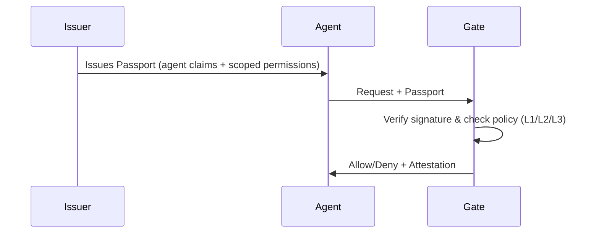

**Uniplex is a passport system for AI agents.**

AI agents are calling APIs, executing tools, and taking real-world actions — but there's no standard way to verify which agent is making a request or what it's actually allowed to do.

Today, most agents authenticate with shared API keys or borrowed OAuth tokens. That means:

- Can't tell which agent made the request.
- Can't scope beyond "has the key."
- Can't prove checks to auditors.

**Uniplex fixes this.** It gives agents portable, signed credentials — Passports — that any tool can verify locally, in the request flow, with no shared secrets and no network round-trips in the hot path.

You keep your existing identity providers. Uniplex adds the portable authorization layer they're missing.

## What can Uniplex enable?

- Verify an agent is allowed to execute a $50K wire transfer — not just that it can call the payments API.
- Give an agent read-only access in production and full access everywhere else.
- When Agent A delegates to Agent B, verify the full chain of trust and ensure permissions weren't escalated.
- Issue credentials that expire in minutes — not API keys that live forever.
- Revoke a compromised agent's access instantly, without rotating shared secrets.
- Every decision produces a signed attestation — show auditors exactly what was authorized, when, and by whom.

## How It Works

**Key insight:** Verification happens locally at the Gate — no round-trip to a central server for every tool call.

## Why Uniplex?

| Feature | API Keys | OAuth 2.0 | Uniplex |
|---------|----------|-----------|---------|
| **Designed For** | Systems/Services | Humans | AI Agents |
| **Scoping** | All-or-nothing | Centralized scopes | Action + Resource + Constraints |
| **Verification** | Server-side lookup | JWT validation or introspection | Local cryptographic + policy check |
| **Latency** | Network round-trip | Often local (JWT); sometimes network | Designed for sub-millisecond local checks |
| **Offline Support** | No | Possible (JWT); not inherent | First-class |
| **Audit Trail** | Opaque logs | Access logs | Signed Attestations (Non-repudiable) |

<Note>
OAuth can be validated locally with JWT access tokens, but Uniplex is purpose-built for agent credentials with tool-bound scoping and local-first verification.
</Note>

## Get Started

<CardGroup cols={2}>
  <Card title="Quickstart" icon="rocket" href="/quickstart">
    Install the SDK and create your first Passport
  </Card>
  <Card title="Passports" icon="id-card" href="/concepts/passports">
    Learn about agent credentials
  </Card>
  <Card title="Gates" icon="shield-check" href="/concepts/gates">
    Understand verification at tool boundaries
  </Card>
  <Card title="Trust Profiles" icon="layer-group" href="/concepts/trust-profiles">
    Choose the right security level
  </Card>
</CardGroup>
