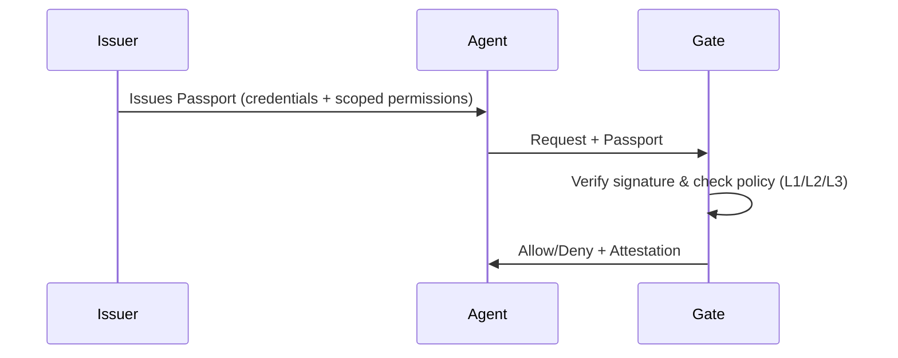

# Uniplex is a Passport System for AI Agents.

AI agents are calling APIs and taking actions with no standard way to verify they're authorized. Uniplex is an open protocol that adds a lightweight trust layer for the agentic web.

<CardGroup cols={2}>
  <Card title="Quickstart" icon="rocket" href="/quickstart">
    Get up and running in 5 minutes
  </Card>
  <Card title="Specification" icon="book" href="/specification/overview">
    Read the full protocol specification
  </Card>
</CardGroup>

---

## Why Uniplex?

- **Passports** — Agents carry signed credentials that prove what they are, who issued them, and what they're allowed to do
- **Gates** — Any tool—MCP servers, APIs, or agent tool calls—can verify passports locally and make an allow/deny decision
- **Pluggable** — Works alongside your existing auth (API keys, OAuth/JWT, mTLS). No rip-and-replace.
- **Local-First** — No network calls in the hot path. No shared secrets.
- **Security Tiers** — L1 (dev) → L2 (production) → L3 (strict)
- **Vendor-Neutral** — Works with any agent framework, model, or tool stack

## How It Works

**Key insight:** Verification happens locally at the Gate — no round-trip to a central server for every tool call.

## Get Started

<CardGroup cols={2}>
  <Card title="Quickstart" icon="rocket" href="/quickstart">
    Install the SDK and create your first Passport
  </Card>
  <Card title="Passports" icon="id-card" href="/concepts/passports">
    Learn about agent credentials
  </Card>
  <Card title="Gates" icon="shield-check" href="/concepts/gates">
    Understand verification at tool boundaries
  </Card>
  <Card title="Trust Profiles" icon="layer-group" href="/concepts/trust-profiles">
    Choose the right security level
  </Card>
</CardGroup>
