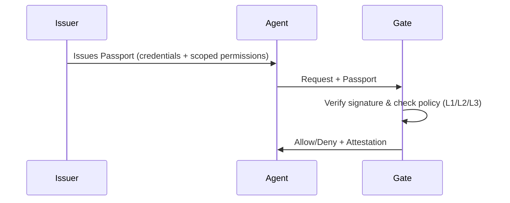

Uniplex is an open protocol for verifiable agent identity and scoped authorization.

AI agents are calling APIs and taking actions across the web — but there's no standard way to verify who they are or what they're allowed to do. Uniplex solves this by giving agents portable, signed credentials (Passports) that any tool can verify locally.

Think of it as **HTTPS for agent authorization**: just as HTTPS provides a standardized way to secure web traffic, Uniplex provides a standardized way to authorize AI agents.

## How It Works

## What can Uniplex enable?

- MCP servers can verify which agents are authorized to access sensitive tools
- Enterprise teams can issue credentials to internal agents with scoped permissions
- Tool providers can accept agent requests without sharing API keys
- Audit systems can verify authorization decisions with signed attestations

## Why Uniplex?

| Feature | API Keys | OAuth 2.0 | Uniplex |
|---------|----------|-----------|---------|
| **Designed For** | Systems/Services | Humans | AI Agents |
| **Scoping** | All-or-nothing | Centralized scopes | Action + Resource + Constraints |
| **Verification** | Server-side lookup | JWT validation or introspection | Local cryptographic check |
| **Latency** | Network round-trip | Often local (JWT); sometimes network | Designed for sub-millisecond local checks |
| **Offline Support** | No | Possible (JWT); not inherent | First-class |
| **Auditability** | Opaque logs | Token-based | Signed attestations |

<Note>
OAuth can be validated locally when using JWT access tokens; Uniplex is purpose-built for agent credentials and tool-bound scoping with local-first verification.
</Note>

## Get Started

<CardGroup cols={2}>
  <Card title="Quickstart" icon="rocket" href="/quickstart">
    Install the SDK and create your first Passport
  </Card>
  <Card title="Passports" icon="id-card" href="/concepts/passports">
    Learn about agent credentials
  </Card>
  <Card title="Gates" icon="shield-check" href="/concepts/gates">
    Understand verification at tool boundaries
  </Card>
  <Card title="Trust Profiles" icon="layer-group" href="/concepts/trust-profiles">
    Choose the right security level
  </Card>
</CardGroup>
