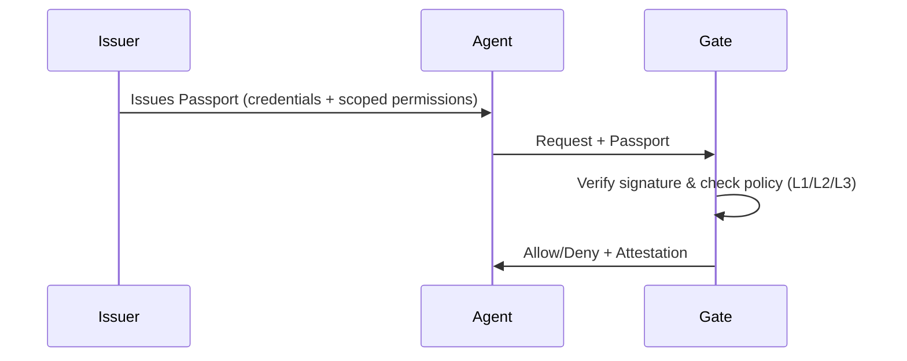

# Uniplex

**The trust layer for AI agents.**

Uniplex is an open protocol that provides verifiable identity and scoped authorization for AI agents. Whether you're building MCP servers, agent frameworks, or internal tools, Uniplex provides a standardized way to verify what an agent is and what it's allowed to do.

## What is Uniplex?

Uniplex is a passport system for AI agents. It enables:

- **Passports** — Agents carry signed credentials that prove what they are, who issued them, and what they're allowed to do
- **Gates** — Any tool can verify passports locally and make an allow/deny decision
- **Trust Profiles** — Scale from L1 (dev/test) to L2 (production) to L3 (strict)

## Key Benefits

<CardGroup cols={2}>
  <Card title="Local-First" icon="bolt">
    No network calls in the hot path. Verification happens locally in sub-millisecond time.
  </Card>
  <Card title="Pluggable" icon="plug">
    Works alongside your existing auth (API keys, OAuth/JWT, mTLS). No rip-and-replace.
  </Card>
  <Card title="Vendor-Neutral" icon="scale-balanced">
    Not tied to any model provider. Works with any agent framework, model, or tool stack.
  </Card>
  <Card title="Open Protocol" icon="lock-open">
    Apache-2.0 licensed. No vendor lock-in.
  </Card>
</CardGroup>

## How It Works

**Key insight:** Verification happens locally at the Gate — no round-trip to a central server for every tool call.

## Next Steps

<CardGroup cols={2}>
  <Card title="Quickstart" icon="rocket" href="/quickstart">
    Get up and running in 5 minutes
  </Card>
  <Card title="Specification" icon="book" href="/specification/overview">
    Read the full protocol specification
  </Card>
</CardGroup>
